内容：
 - 中间件概念详述
 - Dubbo+Zookeeper
 - Zookeeper详谈

# 中间件概念详述
## 中间件的定义
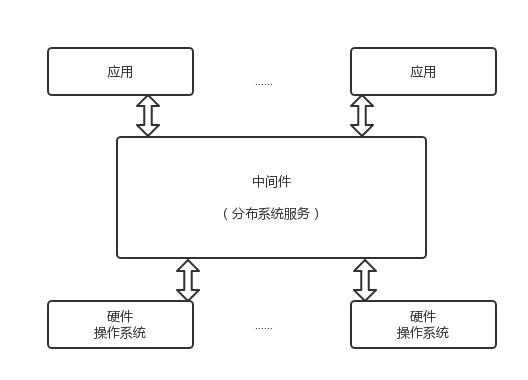
关于中间件的定义各有说辞，这里给出IDC的表述：
>中间件是一类独立的系统软件或服务程序，分布式应用软件借助这种软件在不同的技术之间分享资源，中间件位于客户机服务器的操作系统之上，管理计算资源和网络通信。

根据这一表述可知，中间件的作用是为处于自己上层的应用软件提供运行与开发环境，帮助用户灵活、高效地开发和集成复杂的应用软件的。

## 中间件的特点
- 满足大量应用需要
- 运行于多种硬件和OS平台
- 支持分布式计算，提供跨网络、硬件和OS平台的透明性的应用或服务交互
- 支持标准协议
- 支持标准接口

## 中间件的开发需求
中间件是一类软件，而非一种软件。是在克服复杂的网络应用的共性问题中不断发展而来的。
>中间件应解决的问题
1. 灵活性+可成长性（应对变化的复杂环境）
1. 资源扩展的边界是发散的（应对OS平台和数据库管理的有限资源）
1. 提供分布应用开发、集成、部署和运行管理的整个生命周期的总体运行模型（应对应用支撑）
1. 支持复杂、大范围的企业及应用（应对错综复杂的应用结构）

## 中间件的分类
>IDC将中间件分为六类：
终端仿真/屏幕转换中间件、数据访问中间件、远程过程调用中间件、消息中间件、交易中间件、对象中间件。**至今仍保留的为消息中间件和交易中间件** 其他的以融入其它产品中

中间件的目的为屏蔽分部环境中异构的操作系统和网络协议，提供分布环境下的通讯服务，基于目的和实现机制的不同，分为三类：
- 远程过程调用中间件（RPC）
- 面向消息的中间件（MOM）
- 对象请求代理中间件（ORB）
>现在应用最为广泛的为RPC，其它类型的平台感兴趣的读者可自行研究。

中间件为上层提供通讯服务：同步、排队、订阅发布、广播等
中间件应具有 可扩充性、易管理性、高可用性和可移植性。
## 什么是RPC
RPC（Remote Procedure Call Protocal）远程过程调用协议。
顾名思义，RPC可远程调用过程来执行某种逻辑需要。
RPC需解决的问题：
- 通讯问题（tcp按需连接）
- 寻址问题
- 序列化和编组
- 反序列化

如下图所示
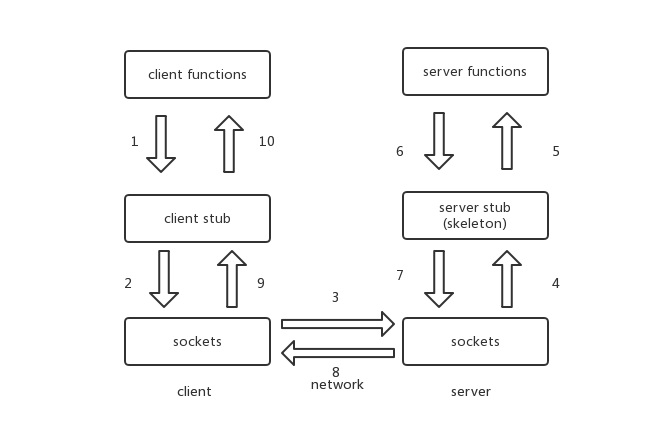
>客户端：寻址、打包序列化、发送、等待接受结果
服务端：接收、反序列化解包、调用方法并返回

# Dubbo+Zookeeper
## 背景
>根据服务请求量的不断增加，架构发展大体呈如下趋势（向下依次为规模更大的架构）

**单一应用架构**：所有功能部署在一起，减少部署节点和成本。
（用于简化增删改查工作量的数据访问框架（ORM）是关键）
**垂直应用架构**：将应用拆成互不相干的几个应用来提高效率。
（用于加速前端页面开发的Web框架(MVC)是关键）
**分布式服务架构**：抽取核心业务，作为独立服务，形成稳定的服务中心。
（用于提高业务复用及整合的分布式服务框架(RPC)是关键）
**流动计算架构**：增加调度中心，基于访问压力实时管理集群容量，提高集群利用率。
（用于提高机器利用率的资源调度和治理中心(SOA)是关键）
## 需求
>在大规模服务化之前，应用可能只是通过 RMI 或 Hessian 等工具，简单的暴露和引用远程服务，通过配置服务的URL地址进行调用，通过 F5 等硬件进行负载均衡。

**F5硬负载均衡器的单点压力过大** 需要注册中心使服务位置透明，实现软负载均衡及故障切换缓解。
**服务间依赖错综复杂，无法描述应用架构关系** 需要能够管理应用依赖关系
**调用量上升** 统计调用量及响应时间，动态调整权重

>因此架构需要具有：注册中心、软负载均衡、故障切换、依赖管理、动态调整

## 架构
现在进入正题，这样的RPC到底是什么样的呢，我们来用一张图展示
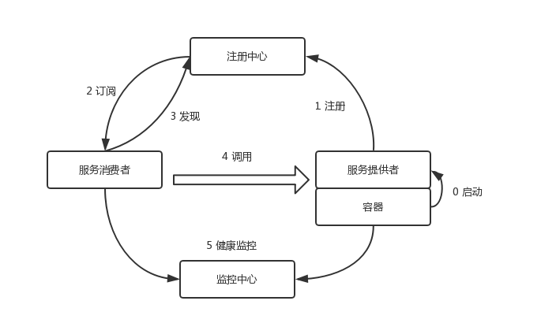
>Dubbo的特点：连通性、健壮性、伸缩性、向未来架构的升级性。
### 连通性
注册中心、服务提供者、消费者均为长连接。注册中心和
监控中心可选，消费者可直接连接服务提供者。
### 健壮性
- 注册中心全部宕掉可通过缓存通讯
- 监控中心宕掉不影响当前使用
- 注册中心宕掉一台自动切换
- 数据库宕掉则使用缓存机制提供服务列表查询，但不可注册新机
- 服务提供者宕掉任一台，不影响使用

### 伸缩性
注册中心为对等集群，可动态增加机器部署实例，所有
客户端将自动发现新注册中心。
	服务提供者无状态，可动态增加机器部署实例，注册中
心将推送新的服务提供者信息给消费者。
### 升级性
即从分布式架构到流动计算架构，如图。
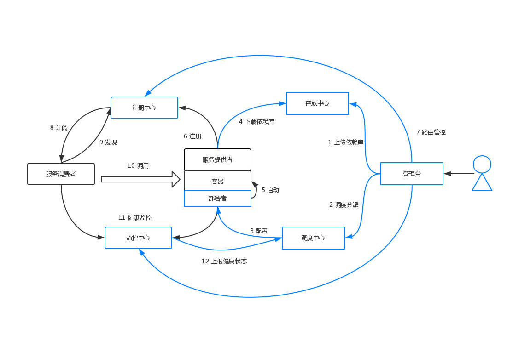
**存放中心**（Repository）：
存储服务应用发布包
**调度中心**（Scheduler）：
基于访问压力自动增减服务提供者
**管理台**（Admin）：
统一管理控制台
**部署者**（Deployer）:
自动部署服务的本地代理

## 注册中心
>注册中心是框架中的核心部分，用于服务的注册与发现，高效、可扩展、高鲁棒性的注册中心会使得框架更加强大

- Muticast注册中心
- Zookeeper注册中心
- Redis注册中心
- Simple注册中心

下面是粗浅的对比
### Muticast注册中心
适用于小规模应用，广播完成互发现，其开发最为便捷，但由于对信道依赖过大，使得其局限性不言而喻。下图为Multicast的原理示意图：
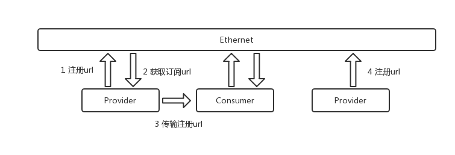
### Zookeeper注册中心
阿里巴巴Dubbo项目推荐注册中心，其采用树形目录，工业强度高，可用于生产环境，但仍有需注意的问题，后面讲详谈。
### Redis注册中心
Key/Map结构，Pub/Sub（即请求应答模式）通知服务数据变更。下图展示其结构。
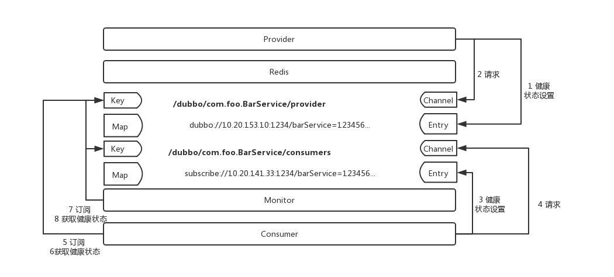
### Simple注册中心
Simple注册中心本身就是一个普通的Dubbo服务，可以减少第三方依赖，使整体通讯方式一致。
# Zookeeper详谈
>先来了解一下Zookeeper的架构和基础

Zookeeper的功能是为分布式应用程序协调服务。其常见服务如下：
  命名服务、配置管理、选举算法（leader）、集群管理、锁定和同步服务、高度可靠的数据注册表
依次介绍内容：
- Zookeeper架构
- 层次命名空间
- 会话
- 监视

## Zookeeper架构
>架构图入下：

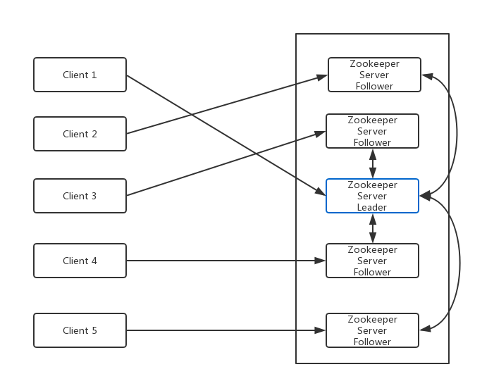
**Client**：从zookeeper服务器获取信息的分布式集群中节点。
**Server**：zookeeper中的节点，为客户端提供多有服务（注册，发现等）
**Ensemble**：服务组，形成Zookeeper服务组至少三个节点。
**Leader**：启动时自动选举，负责写操作。
**Follower**：跟随leader指令的服务器节点。
## 层次命名空间
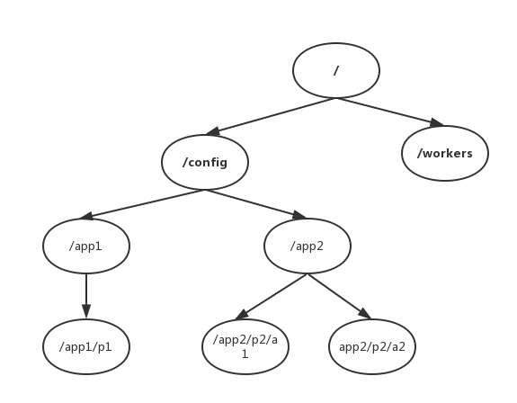
**/**（根目录）
**/config**：用于集中式配置管理
**/workers**:用于命名
ZooKeeper数据模型中的每个znode都维护着一个 stat 结构。一个stat仅提供一个znode的元数据。它由版本号，操作控制列表(ACL)，时间戳和数据长度组成。
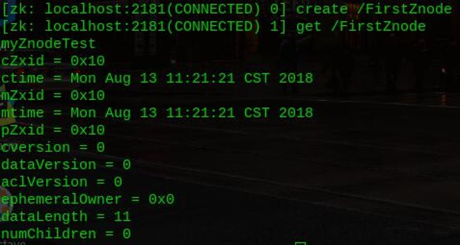
## 会话
>客户端连接到服务器，将建立会话并向客户端分配会话ID。
客户端以特定的时间间隔发送心跳以保持会话有效。如果ZooKeeper集合在超过服务器开启时指定的期间（会话超时）都没有从客户端接收到心跳，则它会判定客户端死机。
当会话由于任何原因结束时，在该会话期间创建的临时节点也会被删除。
## 监视
>用一张图来展示

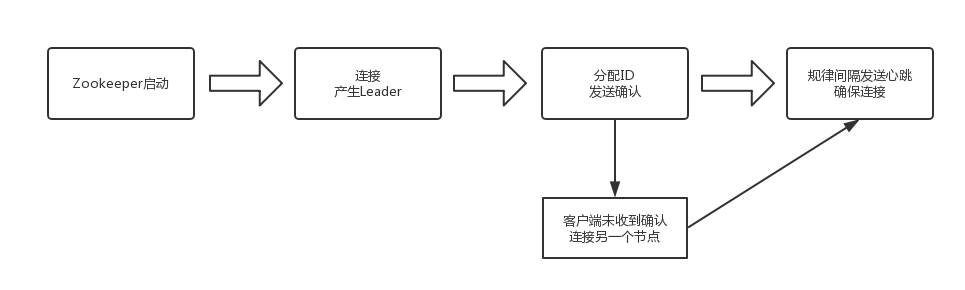
## 沉思
>阿里Dubbo官方文档末尾：阿里内部并没有采用Zookeeper做为注册中心，而是使用自己实现的基于数据库的注册中心。

我们先来了解下CAP原理、ACID、BASE思想

**CAP**（consistency availability Partition tolerance）：
数据同步（一致性）
任何时候，任何应用程序都可读写数据（可用性）、分区容忍性（可靠性）
***定理***：任何分布式系统只可同时满足两点，没有办法三者兼顾

**ACID**：
Atomicity原子性（事务全完成/全不完成）  Consistency 一致性（事务开始或结束时一致）  
lsolation隔离层（事务只有自己在操作数据库） Durability持久性（事务完成不能返回）

**BASE**：反ACID模型，牺牲高一致性
Basically Available（基本可用）支持分区失败
Soft state：（软状态）状态可以有一段时间不同步
Eventually consistent（最终一致）数据最终保持一致
### 注册中心是AP还是CP系统
先来看看AP会发生什么
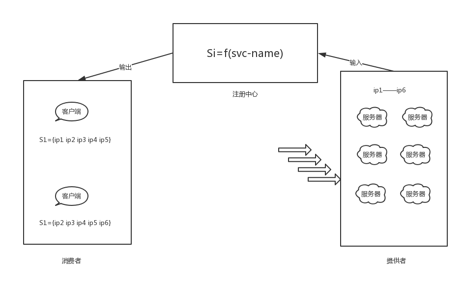
>这样可能会发生的事情就是，在一个时段内，S1收到的是{**ip1** ip2 ip3 ip4 ip5}，而S2收到的是{ip2 ip3 ip4 ip5 **ip6**}，这是舍弃一致性的结果。但是，在分布式系统中，即使是对等部署的服务，因为请求到达的时间，硬件的状态，操作系统的调度，虚拟机的 GC 等，任何一个时间点，这些对等部署的节点状态也不可能完全一致，而流量不一致的情况下，只要注册中心在SLA承诺的时间内（例如1s内）将数据收敛到一致状态（即满足最终一致），流量将很快趋于统计学意义上的一致，所以注册中心以最终一致的模型设计在生产实践中完全可以接受。

再来看看CP会发生什么
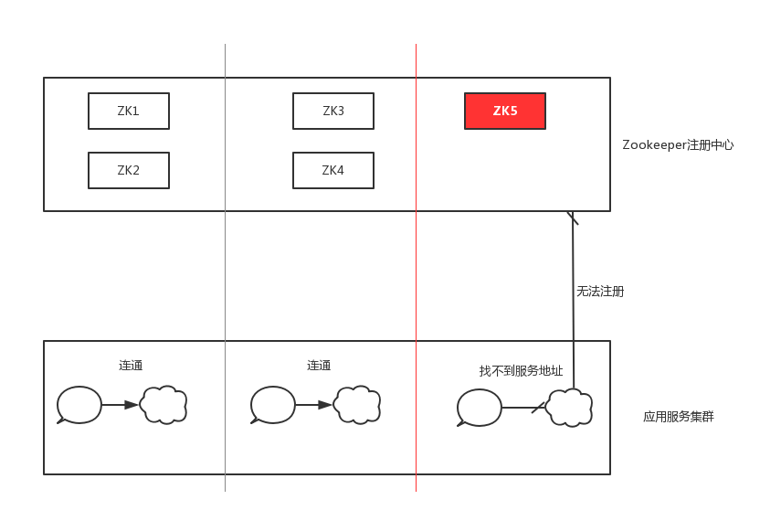
>虽然整体 ZooKeeper 服务是可用的，但是节点ZK5是不可写的，因为联系不上 Leader。

所以注册中心在CAP原理下**AP**更重要。

>**注册中心不能因为自身的任何原因破坏服务之间本身的可连通性，这是注册中心设计应该遵循的铁律**

### 服务规模、容量、服务连通性
Zookeeper通过leader来进行写操作，读则通过消费者在注册中心获取服务地址列表后直接建立连接（并实时检测健康度）
因此，注册中心压力来源为下图：
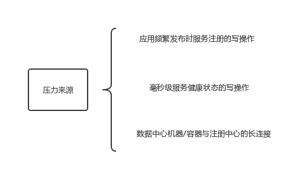
>这一问题的解决方案：垂直划分业务层，各业务使用各自的zookeeper注册中心
（但各业务一定老死不相往来吗，这再一次破坏了连通性铁律）

### 注册中心需要持久化存储和事务日志吗
>Zookeeper的ZAB协议对每个写请求保持写一个事务日志，定期将内存数据映射到磁盘来保证数据一致性和持久性。（保证数据的一致性和持久性，以及宕机之后的数据可恢复）
在服务发现场景中，实时健康的服务地址列表需要持久化吗（答案是 否）

**观点结论**
***需要***：完整注册中心该有数据恢复的能力，还应有服务的元数据信息，并提供检索。
***不需要***：服务消费者更关注现在的地址和健康状态，不关注过去。

### ServiceHealth Check
>服务的健康监测绑定在了zookeeper对于session的健康检测上，即绑定在了TCP长连接活性探测上了。

真实的健康状态应交由服务提供方自行定义。

### 注册中心的容灾考虑
>服务调用（请求响应流）链路应该是弱依赖注册中心。

因此，客户端应实现缓存数据机制，若zookeeper中的znode全部宕掉，不能影响链路中服务交互。

# Reference
https://baike.baidu.com/item/%E4%B8%AD%E9%97%B4%E4%BB%B6/452240?fr=aladdin#6
https://blog.csdn.net/b1303110335/article/details/79557292
https://dubbo.incubator.apache.org/zh-cn/docs/user/preface/background.html
https://dubbo.incubator.apache.org/zh-cn/docs/user/references/registry/zookeeper.html
https://www.w3cschool.cn/zookeeper/
https://www.jdon.com/37625
http://jm.taobao.org/2018/06/13/%E5%81%9A%E6%9C%8D%E5%8A%A1%E5%8F%91%E7%8E%B0%EF%BC%9F/

# 声明
>本文内容全部来源于“wqn的博客”博主编写，参考文档已在“reference”标明，如有转载请标明出处。
所有图片使用 ProcessOn 工具绘制，若不清晰点击放大即可
若对博文有所提议请联系（博客顶部**关于**），或者同样喜欢这部分内容的可以一起讨论。
