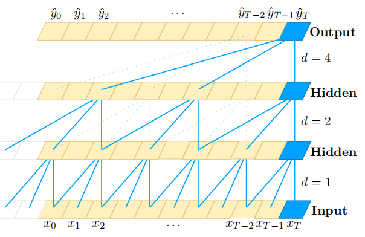
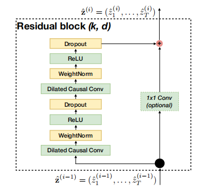

本论文原文为公认的最早提出TCN的通用论文，以下为阅读本文记录，详细内容请参考以下原文链接：
[An Empirical Evaluation of Generic Convolutional and Recurrent Networks for Sequence Modeling](https://arxiv.org/abs/1803.01271)
> 在大多数深度学习从业者而言，序列建模与循环网络同义。但本文研究发现，卷积结构在音频合成和机器翻译等任务上的表现优于循环网络。同时卷积结构展示了更好的应用效果和更长的记忆。
#Introduction
本文针对的任务：
- 有韵律变化的音乐建模
- 单词和字符级语言建模
- 经过专门设计并经常用于对RNN进行基准测试的综合压力测试

本文描述了一个尽量简单的通用的temporal convolutional network（TCN）架构，并与典型循环架构（LSTM、GRU）进行比较。该通用的TCN模型通过了循环网络的各种baseline因此说明其可能将成功用于更加宽泛的序列问题。
同时作者更加深入的分析了循环网络的内存保留特性，尽管理论上RNN可以捕捉无限长的历史信息，但TCN显示了更长的存储历史域。
>实验表明，TCN比经典的RNN架构（LSTM、GRU）更加准确、更简单、更清晰。

TCN的特征：
1. 卷积架构遵循“因果”，即当前结果只源于过去的输入
1. TCN接受任意长度的序列输入，并且映射为一个等长的输出序列
1. TCN通过扩大残余层和扩大卷积使网络有了更长的记忆

TCN的设计原则为：
1. 组成简单（比[WaveNet]([https://arxiv.org/pdf/1609.03499.pdf](https://arxiv.org/pdf/1609.03499.pdf))更简单）
1. 自回归预测
1. 非常长的记忆
1. 没有跨层、条件反射、上下文堆叠或门控激活的跳过连接

# Sequence Modeling
首先有这样一个序列问题模型的通用函数：$f:X^{T+1} \to Y^{T+1} $
即产生如下映射，
$$
\hat y_0,...,\hat y_T = f(x_0,...,x_T)
$$
该式满足因果约束。
# Causal Convolutions
> 上面提到的两个TCN遵守的原则：网络产生输出与输入的长度相同、因果。

首先为满足第一个原则，TCN采用 **1D fully-convolutional network（FCN）** 架构（每个隐层长度与输出长度相同）
其次为了满足第二个原则，TCN采用**因果卷积（causal convolutions）**（ $t$时刻的输出仅是t时刻的层和更早的前面的层进行的卷积）
$$
TCN = 1D \  FCN + causal \ convolutions
$$
> 为了实现长期有效的历史记忆，则需要极其深的网络层数，或者非常大的过滤器，然而这两种方式在初次实验时都是不可行的。以下结合现代方法实现深层的网络和长期的记忆。

# Dilated Convolutions
定义序列元素$s$上的扩张卷积运算：
$$
F(s) = (x*_df)(s)= \sum^{k-1}_{i=0}f(i) \cdot x_{s-d \cdot i}
$$
$d$是扩张因子（随网络层数以指数级增长），$k$是滤波器大小，$s-d\cdot i$说明过去的方向。
如下图所示

如图可看出，有两个方式增加接收域：
- 选择一个更大的滤波器（$k$的值）
- 增加扩张因子$d$
此时每层有效的历史记忆度量为$(k-1)d$
# Residual Connections
残差块包含一个分支，其导致一系列的变化$F$，其输出被添加到块的输入$x$中。
$$
o = Activation(x+F(x))
$$
缓和恒等映射而不是完全的转换。
> 考虑到越来越大的历史记忆需求是的网络的深度$n$、扩张因子$d$、滤波器大小$k$都在增大，如此“深”的网络其稳定性变得非常重要。因此TCN使用残余模型来替换卷积层。

残余模型如下图所示：

如图，为了保证输入输出的宽度相同，使用底层输入的1×1 Conv来解决差异。